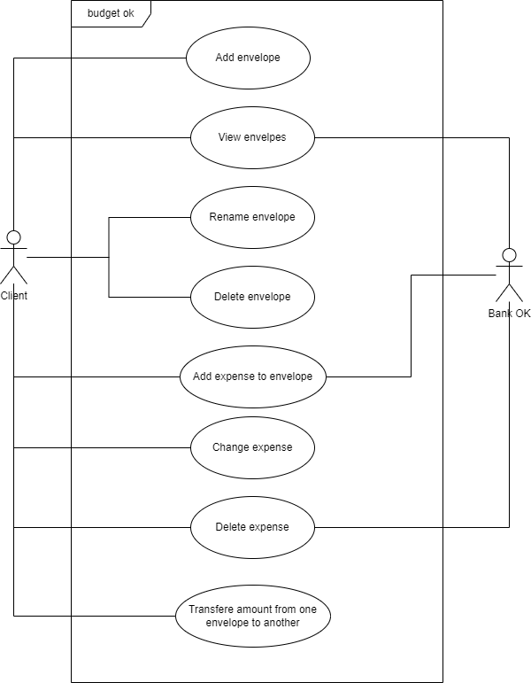

# System Behavior (Use Cases)

## Use Case Diagram

Primary Actors:
- User

Use Cases:
- Add envelope
- View envelopes
- Rename envelope
- Delete envelope
- Add expense to envelope
- Change expense
- Delete expense
- Transfere amount from one envelope to another

Secondary Actors:
- Bank OK

## Use Case Narrative: Add expense to envelope

### Use Case Name
Add expense to envelope

### Primary Actor
User

### Goal
The user successfully adds an expense to envelope.

### Preconditions
- The user is registered and logged into the system.

### Main Success Scenario
1. The user enters expense name.
2. The user enters expense amount.
3. The user submits the expense.
4. The system validates the name length.
5. The system validates the amount is positive.
6. The system creates the expense.
7. The system provides an expense confirmation to the user.

### Extensions (Alternative Flows)
- 4a. Name length is too long:
    - The system notifies the user that name is too long.
- 5a. Non-positive amount:
    - The system notifies the user and suggests entering a valid amount.

### Postconditions
- The expense is created and stored in the system.
- The user receives an expense confirmation.
