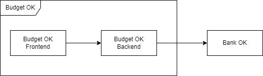

# System Behavior (Architecture)

## Architecture Style

- Frontend + Monolithic Backend

## Architecture Diagram

Frontend & Monolithic Backend:

## Tech Stack

Programming Languages:
- Java
- TypeScript

Database:
- PostgreSQL

## Repository Strategy

- Multi-Repo approach

## Component Repositories

[Frontend repository](https://github.com/ognjenkl/budget-ok-web)

[Backend repository](https://github.com/ognjenkl/budget-ok-backend)